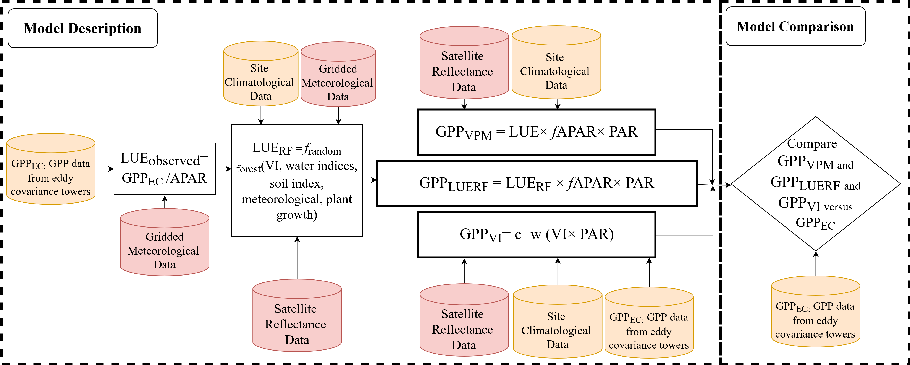
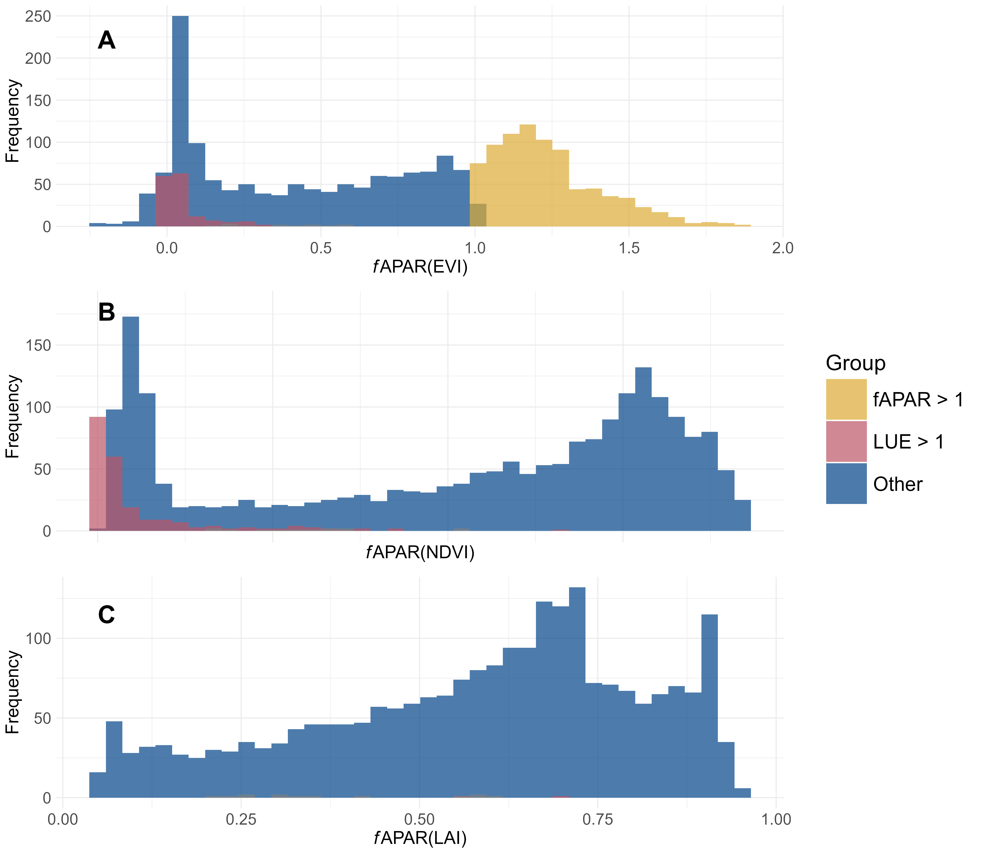
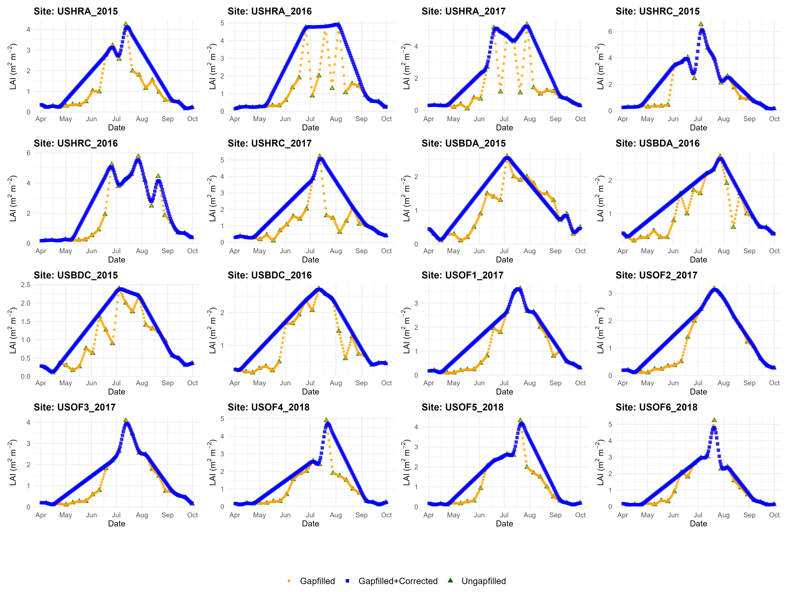
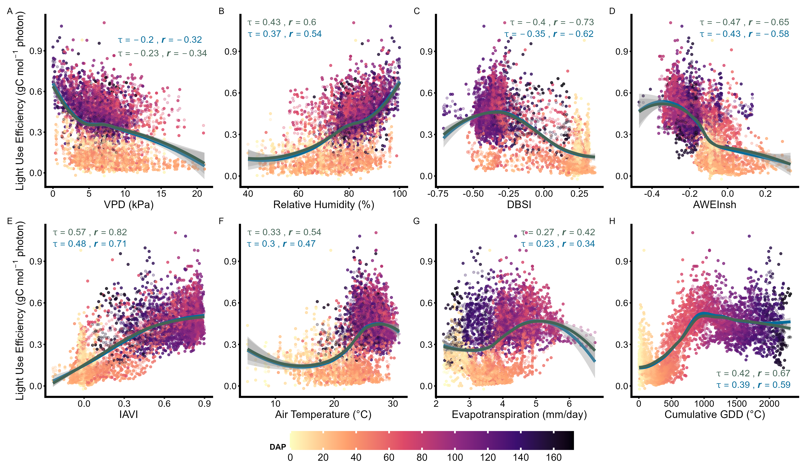
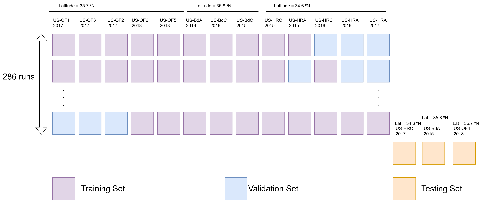
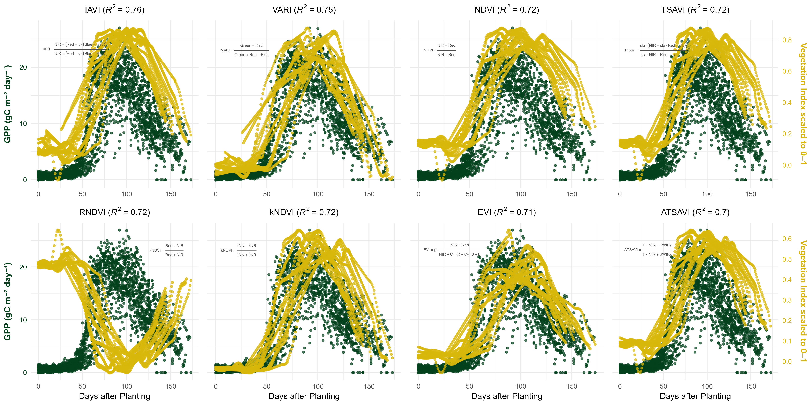

# Rice GPP Modeling in Arkansas: VPM, LUE-RF, and VI Approaches

**Riasad Bin Mahbub** | University of Arkansas | 2023–2025

This repository contains the complete analytical workflow for the manuscript:

> *"Magnitude, drivers, and patterns of gross primary productivity of rice in Arkansas using a calibrated vegetation photosynthesis model"*

---

## Overview

We model daily Gross Primary Productivity (GPP) of rice fields across Arkansas by combining eddy covariance (EC) tower measurements, harmonized satellite reflectance (Landsat 7/8 + Sentinel-2), and gridded meteorological data. Three complementary approaches are compared:

| Model | Abbreviation | Method |
|---|---|---|
| Vegetation Photosynthesis Model | GPPVPM | LUEmax × Tscalar × Wscalar × fAPAR × PAR |
| Random Forest LUE | GPPLUERF | RF-predicted LUE × fAPARLAI × PAR |
| Vegetation Index linear | GPPVI | Linear regression: GPP ~ VI × PAR |

**Key calibrated parameters for Arkansas rice:**
- LUEmax = 0.06038 mol CO₂ mol⁻¹ PPFD
- Topt = 30.02 °C

---

## Repository Structure

```
PVPM_GPP_Arkansas/
│
├── Data/                          # Input datasets
│   ├── EC_tower/                  # Half-hourly eddy covariance GPP by site-season
│   ├── Meteorological/            # Site-level temp, PAR, VPD, humidity
│   └── Satellite/                 # Harmonized VI time series (EVI, NDVI, LSWI, etc.)
│
├── Scripts/
│   ├── R_Scripts/
│   │   ├── VPM_Site/              # Active working scripts (use these)
│   │   └── Archive/               # Legacy / exploratory scripts
│   └── GEE_Scripts/
│       └── VPM/
│           └── YearWiseVPMStateScale/   # GEE export scripts for EVI, LSWI, T, PAR
│
└── Figures/                       # Output figures referenced in the manuscript
    ├── LUEbiophysical.png
    ├── GPPVI_dual_axis.png
    ├── LAI_16sites_onelegend.png
    ├── PVPMworkflow7-11-2024.png
    ├── KFoldValidation.drawio.png
    ├── best predictor seed node impurity.png
    └── combined_fapar_plot.png
```

---

## Study Design

- **Sites:** 10 EC tower rice fields in Arkansas (16 site-seasons, 2015–2018)
- **Temporal resolution:** Daily
- **Spatial resolution:** Field-scale
- **Validation:** k-fold cross-validation — 10 sites training / 3 validation / 3 testing



---

## Workflow

### Step 1 — Satellite Data Preparation (Google Earth Engine)

Run the GEE scripts in `Scripts/GEE_Scripts/VPM/YearWiseVPMStateScale/` to export:
- EVI and LSWI (for fAPAR and water stress)
- Temperature and PAR (gridded drivers)
- Harmonized Landsat 7/8 + Sentinel-2 reflectance (30 m, daily gap-filled)

Harmonization steps include cloud masking, BRDF correction, inter-sensor band adjustment (using SIAC atmospheric correction), and Savitzky–Golay smoothing.

### Step 2 — Site-Scale Data Assembly

```
Scripts/R_Scripts/VPM_Site/SiteDataDaily.R
Scripts/R_Scripts/VPM_Site/SiteDailyData_Function.R
```

- Reads and merges EC tower GPP, site meteorological data, and satellite VIs
- Computes daily GDD, cumulative GDD, cumulative daylength, DAP, DOP
- Calculates fAPAR using three methods: EVI-based, NDVI-based, LAI-based (Beer–Lambert)

**fAPAR comparison:**



LAI-based fAPAR (Beer–Lambert: `1 − exp(−0.5 × LAI)`) was selected as the most physically consistent method — only 0.1% of resulting LUE values exceeded 1 g C mol⁻¹ photon, versus 7.2% for EVI-based and 9.9% for NDVI-based.



### Step 3 — VPM Calibration

```
Scripts/R_Scripts/VPM_Site/LUEmaxGDDallsites.R
Scripts/R_Scripts/VPM_Site/VPM_model.R
```

Calibrate LUEmax and Topt against GPPEC data. Site-calibrated values for Arkansas rice (LUEmax = 0.060, Topt = 30.02 °C) outperform biome-default parameters.

### Step 4 — LUE Dynamics and Feature Selection

```
Scripts/R_Scripts/VPM_Site/PVPM_RFE.R
Scripts/R_Scripts/VPM_Site/ExplainRandomForestLUE.R
```

LUEobserved = GPPEC / (fAPARLAI × PARsite)

Recursive Feature Elimination (RFE) identified 19 optimal predictors from vegetation indices, water indices, meteorological drivers, phenological features, and a soil index.

**LUE biophysical dynamics:**



LUE peaks around 1,200 °C cumulative GDD (mid-reproductive stage) and declines toward harvest. The pattern is consistent across all 16 site-seasons.

**Top predictors (node impurity):**


### Step 5 — Random Forest LUE Model (GPPLUERF)

```
Scripts/R_Scripts/VPM_Site/PVPM_Model.R
Scripts/R_Scripts/VPM_Site/PVPM_model_78Runs.R
Scripts/R_Scripts/VPM_Site/SeedRunRandomForest.R
```

Trains a Random Forest on the 19 selected predictors to predict LUERF. Final GPP:

```
GPPLUERF = LUERF × fAPARLAI × PARsite
```

Cross-validation structure:



Key predictors: ExG, IAVI, VARI (greenness); AWEInsh, MLSWI26, MuWIR (water stress); Tair, rH, VPD, Es (microclimate); GDDcum, daylcum, DAP, DOP (phenology).

### Step 6 — VI Linear Model (GPPVI)

```
Scripts/R_Scripts/VPM_Site/SingleVI.R
Scripts/R_Scripts/VPM_Site/SingleVI_LUE.R
Scripts/R_Scripts/VPM_Site/SingleVI78Runs.R
```

Evaluates 8 vegetation indices (IAVI, VARI, NDVI, TSAVI, RNDVI, kNDVI, EVI, ATSAVI) using:

```
GPPVI = c + w × (VI × PARsite)
```



### Step 7 — Spatial GPP Modeling (State Scale)

```
Scripts/R_Scripts/VPM_Site/ModeledPVPMVPM_satelliteProcessing.R
Scripts/R_Scripts/VPM_Site/plot_PVPM_sitescale.R
```

Applies calibrated VPM across Arkansas rice pixels (2008–2020, 500 m) exported from GEE. Analyzes spatial and interannual GPP patterns and their relationship with county-level rice yield.

---

## R Script Reference

| Script | Purpose |
|---|---|
| `SiteDataDaily.R` | Main data reading and merging pipeline |
| `SiteDailyData_Function.R` | Helper functions for data assembly |
| `SiteDataDailyBruteForce.R` | Alternative brute-force data assembly |
| `VIMeteoCheck.R` | Quality checks on VI and meteorological inputs |
| `fAPAR_EVI_NDVI_LAI.R` | fAPAR calculation and comparison |
| `LUEmaxGDDallsites.R` | LUEmax calibration across sites |
| `GraphMakingLUEmax.R` | LUE visualization across GDD |
| `VPM_model.R` | VPM implementation with calibrated parameters |
| `PVPM_RFE.R` | Recursive Feature Elimination for LUE predictors |
| `PVPM_Model.R` | Core RF model training, validation, and testing |
| `PVPM_model_78Runs.R` | Multi-run RF model for stability assessment |
| `SeedRunRandomForest.R` | Seed-based reproducible RF runs |
| `ExplainRandomForestLUE.R` | SHAP / importance-based RF interpretation |
| `SingleVI.R` | Single-VI GPP linear model |
| `SingleVI_LUE.R` | Single-VI LUE linear model |
| `SingleVI78Runs.R` | Multi-run VI model evaluation |
| `ModeledPVPMVPM_satelliteProcessing.R` | Spatial raster GPP processing |
| `plot_PVPM_sitescale.R` | Site-scale GPP visualization |

---

## Key Dependencies

```r
# Install all required packages
install.packages(c(
  "randomForest", "ggplot2", "ggpubr", "dplyr",
  "caTools", "viridis", "Metrics", "caret"
))
```

---

## Data Sources

| Dataset | Variable(s) | Source |
|---|---|---|
| Eddy covariance GPP | GPPEC | Site PI networks (Leavitt, Reba, Massey et al.) |
| Landsat 7/8, Sentinel-2 | EVI, NDVI, LSWI, + 13 VIs | GEE / EROS / Copernicus |
| PRISM | Tair, Tmax, Tmin, precip | Daly et al. (2008) |
| gridMET | VPD, RH, DSWR | Abatzoglou (2013) |
| Daymet | Daylength | Thornton et al. (2014) |
| VIIRS LAI/FPAR v2 | LAI | Myneni (2023) |
| PML_V2 | Ec, Es, Ei, ET | Y. Zhang et al. (2019) |

---

## Citation

If you use this code, please cite:

> Mahbub, R.B. et al. (2025). *Magnitude, drivers, and patterns of gross primary productivity of rice in Arkansas using a calibrated vegetation photosynthesis model.* Agricultural and Forest Meteorology, 369, 110583.

---

## Contact

**Riasad Bin Mahbub**
University of Arkansas
rbmahbub@uark.edu